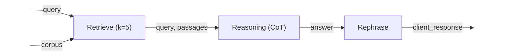
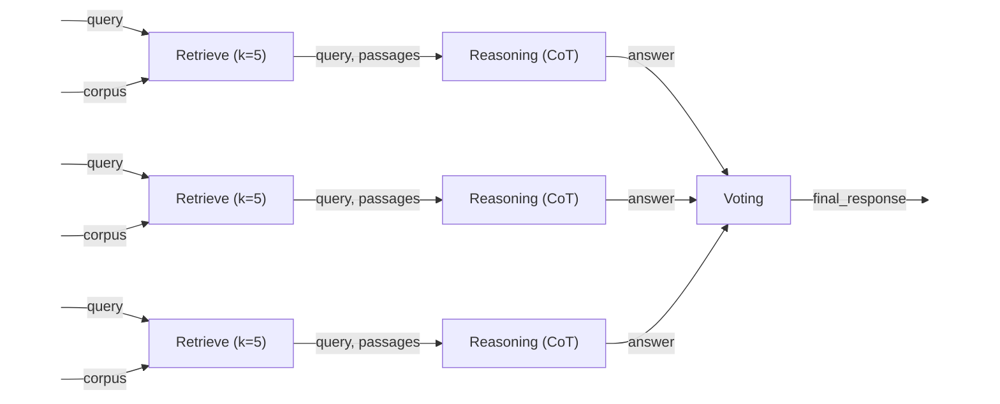
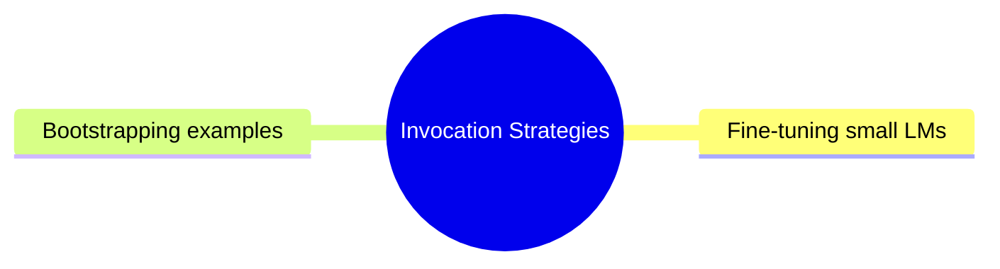
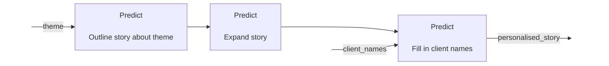
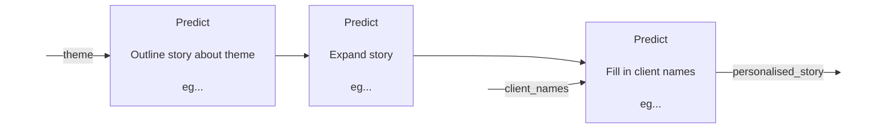

---
# You can also start simply with 'default'
theme: seriph
# random image from a curated Unsplash collection by Anthony
# like them? see https://unsplash.com/collections/94734566/slidev
background: https://cover.sli.dev
# some information about your slides (markdown enabled)
title: Intro to DSPy
info: |
  ## DSPy introductory slides

# apply unocss classes to the current slide
class: text-left
# https://sli.dev/features/drawing
drawings:
  persist: false
# slide transition: https://sli.dev/guide/animations.html#slide-transitions
transition: slide-left
# enable MDC Syntax: https://sli.dev/features/mdc
mdc: true
---

# DSPy

<div class = "pt-12">
Demonstrate - Search - Predict 
</div>

<div class="text-right">
Algorithmically optimizing LM pipelines
</div>

---

# The Aim

<div class="pt5">
    Imperative -> Declarative
</div>

<div class="pt15"></div>

<div class="flex">
    <div v-click="1" class="w-1/2 pr-8">
        “You are a secret agent with amazing powers of perception. Please answer the question using the information provided. Please use only this information to answer the question. Please reply in JSON. Keep your hands and feet inside the vehicle at all times. Don’t lie operating instructor….”
    </div>
    <div v-click="2" class="w-1/2 pl-8">
        <span v-mark.underline.blue="3">“Question, context -> answer” </span>
    </div>
</div>

---

  <div class="pt50">
  LM programs are Text Transformation Pipelines
  </div>


---

# Text Transformation Graph

<div class="pt30"></div>


---



---

# Modular Operators

- **Predict**
- **Chain-of-Thought**
- **Chain-of-Program**
- **Simplified Baleen**
- **RAG**
- **Ensemble**

---

# Pipeline Optimization




<!-- - A compiler automatically generates optimized LM **_invocation strategies._**
  - Bootstrapping examples from a training set, or building examples by running the program itself
  - Fine-tune small LMs -->

---

# Optimization 2

Writing a personalised story:



<div v-click="1">

- For each “predict” module
  1. Run the prompt with a high temperature.
  2. Collect a trainset of good examples.
  3. Bootstrap the prompts.
  4. And/or finetune the LM.
   
</div>

<div v-click="2">


</div>

---

# Drawbacks

- Internal prompt are hard to see / change
- English only internal prompts

---

# Implementation

```python {monaco}
class MySuperCoolPipeline(dspy.Module)

    def __init__(self, num_passages = 3):
        self.retrieve = dspy.Retrieve(k=num_passages)
        self.generate_answer = dspy.ChainOfThought("question, context --> answer")
        self.rephrase = dspy.Predict("answer -> answer_in_corporate_tone")

    def forward(self, question):
        context = self.retrieve(question).passages
        prediction = self.generate_answer(context, question)
        client_answer = self.rephrase(prediction)
        return client_answer

```

---

# Optimisation

```python {monaco}
    optimizer = BootstrapFewShot(
        metric=our_evaluation_metric,
        teacher = "gpt-4",
        )

    compiled_pipeline = teleprompter.compile(MySuperCoolPipeline(), trainset=trainset)
```

---

# Usage

```python {monaco}
    answer = compiled_pipeline(question)
```

---

# Tools

```python {monaco}
react = dspy.ReAct("question -> answer", tools =[ dspy.Retrieve(k=5) ], max_iters =5)
```
