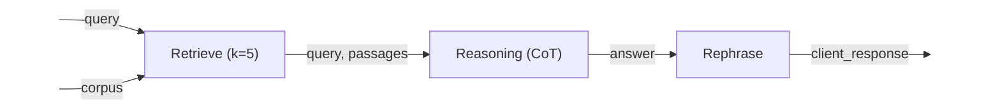
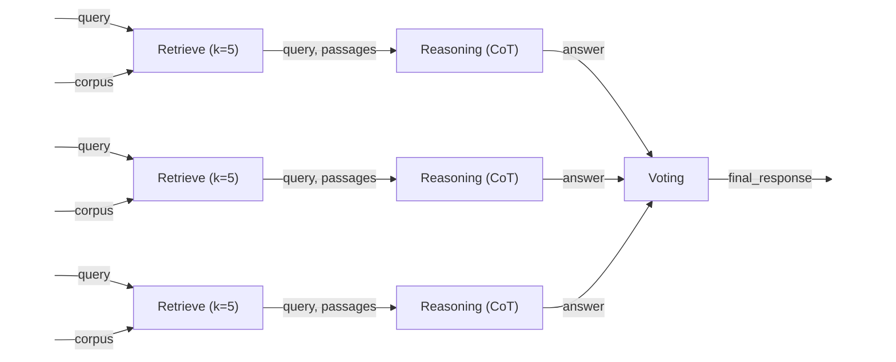
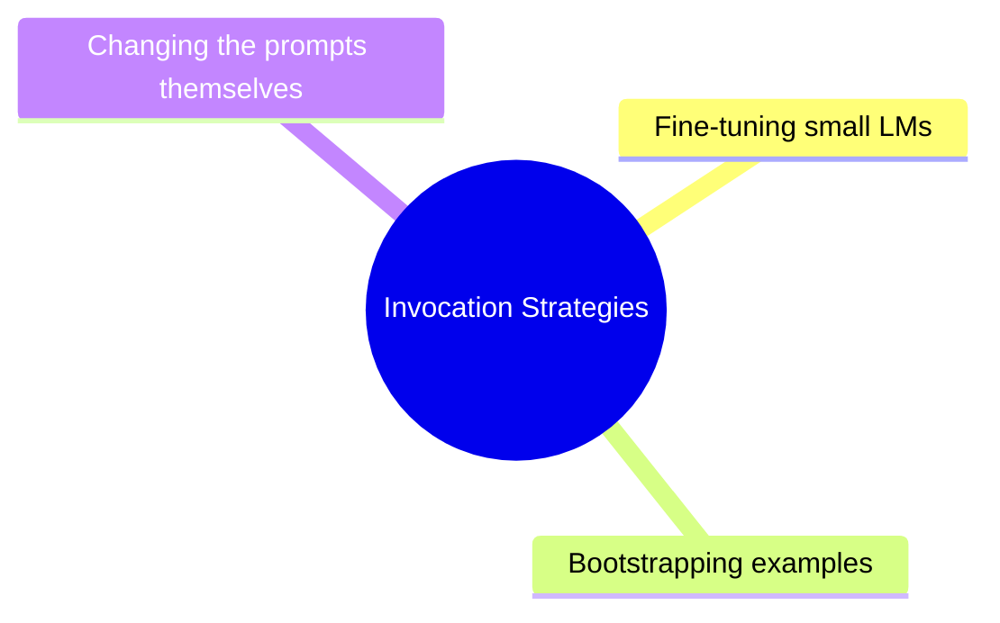
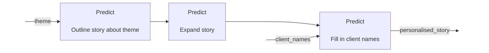
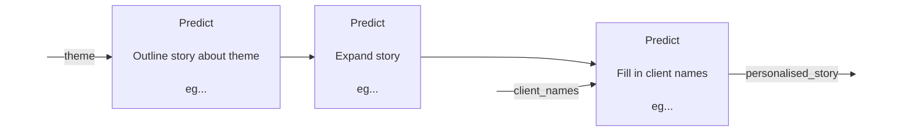

---
# You can also start simply with 'default'
theme: seriph
# random image from a curated Unsplash collection by Anthony
# like them? see https://unsplash.com/collections/94734566/slidev
background: https://cover.sli.dev
# some information about your slides (markdown enabled)
title: Intro to DSPy
info: |
  ## DSPy introductory slides

# apply unocss classes to the current slide
class: text-left
# https://sli.dev/features/drawing
drawings:
  persist: false
# slide transition: https://sli.dev/guide/animations.html#slide-transitions
transition: slide-left
# enable MDC Syntax: https://sli.dev/features/mdc
mdc: true
---

# DSPy

<div class = "pt-12">
Declarative Self-improving Python 
</div>


---

# The Aim

<div class="pt5">
    Imperative -> Declarative
</div>

<div class="pt15"></div>

<div class="flex">
    <div v-click="1" class="w-1/2 pr-8">
        “You are a secret agent with amazing powers of perception. Please answer the question using the information provided. Please use only this information. Please don't lie to me. Please reply in JSON….”
    </div>
    <div v-click="2" class="w-1/2 pl-8">
        <span v-mark.underline.blue="3">“Question, context -> answer” </span>
    </div>
</div>

---

  <div class="pt50">
  LM programs are Text Transformation Pipelines
  </div>


---

# Text Transformation Graph

<div class="pt30"></div>


---



---

# Signatures, Modules and Optimizers

<div v-click="1">
```python {monaco}
signature = "question, context -> answer"
```
</div>

<div v-click="2">
-
</div>

<div v-click="3">
```python {monaco}
question_answerer = dspy.Predict("question, context -> answer")
```
</div>

<div v-click="4">
```python {monaco}
response = question_answerer("What is the capital of France?", context)
print(response.answer)
```
</div>

<div v-click="5">
-
</div>


<div v-click="6">
```python {monaco}
class MySuperCoolPipeline(dspy.Module)

    def __init__(self, args):
        initialise_modules(args)

    def forward(self, args):
        return call_modules(args)
```
</div>

<div v-click="7">
-
</div>

<div v-click="9">
```python {monaco}
    compiled_pipeline = optimizer.compile(MySuperCoolPipeline())
```
</div>


---

# Modules

- **Predict**
- **Chain-of-Thought**
- **Chain-of-Program**
- **Simplified Baleen**
- **RAG**
- **Ensemble**

---

# Pipeline Optimization




<!-- - Optimized LM **_invocation strategies._**
- Generated by the **compiler**
- Examples from a training set
-  or, generated by running the program itself.
- Fine-tune small LMs -->

---

# Optimization 2

Writing a personalised story:


<br/>
<br/>

<div v-click="1">

- For each “predict” module
  1. Collect examples from real runs
   
</div>

<br/>
<br/>

<div v-click="2">


</div>

---

# More things

- All lm calls are cached
- LiteLLM under the hood
- LMs can be set seperately for each module

---

# Drawbacks

- Internal prompt are hard to see / change
- English only internal prompts

---

# My takes

<!-- 
- High-level 
- Let's me focus on designing data pipelines
- Prevents prompt friction 
- Future proofs if I trust the module <- research
 -->

---

# End of Pt. 1